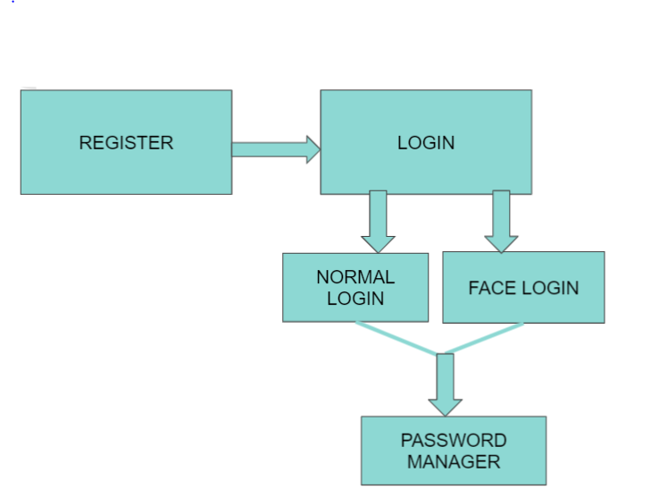
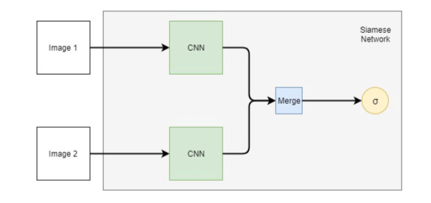

# Face Recognition System

## Password Manager Website

- User can register with an email address and password.
- User needs to provide his/her photo.
- Email activation is necessary.
- User can login with normal email and password or by using Face login option.
- User can add passwords of other applications.
- He/she can update and delete the passwords of other applications.
- An email will be sent in case you need to view the password.

### Encryption of password

- User’s password is stored in an encrypted format using SHA256 algorithm.
- The passwords in the password manager are encrypted using AES algorithm.
- For each user, the application generates a unique key which is then used to encrypt the user’s stored passwords

# Facial Recognition using Deep Learning

## Dataset
We have used the Labelled Faces in the Wild dataset

It consists of :
- Classes : **2**
- Samples total :**13233**
- People :**5828**

## Siamese Network

### Model:
- Input: 2 images of size (96,96,3)
- Gives face embeddings consisting of a vector of 128 features
- Find the Euclidean Distance between the two face embeddings
- We then pass the euclidean distance to a sigmoid activation function which gives us a value between 0 to 1.
- We then consider the faces same if the output is greater than the Threshold.
- Threshold is set to 0.75 by us.
